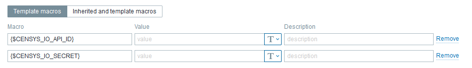
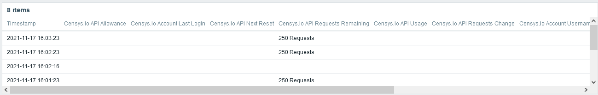

# Zabbix_Censys.io-API-Status
Zabbix Template for Censys.io API Status 

<!-- Start Document Outline -->

* [Background](#background)
* [Installation](#installation)
* [Methodology](#methodology)
* [Triggers](#triggers)
* [Tags](#tags)
* [Macros](#macros)
* [Screenshots](#screenshots)
	* [Data](#data)
	* [Triggers](#triggers-1)
	* [Macros](#macros-1)
	* [Graphs 1](#graphs-1)
	* [HTTP Request Status](#http-request-status)
	* [Dashboard - Credit Detail](#dashboard---credit-detail)
* [Updates](#updates)
* [Contact](#contact)
* [License](#license)
* [Thanks](#thanks)

<!-- End Document Outline -->

## Background 
This template is used to monitor and alert on Censys.io API usage using the Censys.io Account API. 
Built in Zabbix 5.4.  May work with other versions.

## Installation
- Import Template (zabbix-censys-io-api-status.yaml)
- Create Host "Censys.io API"
 - Add an agent interface (necessary, but unused)
 - Assign the "Censys.io API Provider Status" template to the host
 - Update the Macros: {$CENSYS_IO_API_ID} and {$CENSYS_IO_SECRET} accordingly 

## Methodology
This template uses an HTTP agent item to set a parent data item.  Dependent and calculated items are used to pull data from the parent object.  Triggers are then configured according to the API allowance and dependent items.

## Triggers
- API Allowance Change
- 50% Allowance Remaining
- 25% Allowance Remaining
- 0 Allowance Remaining

## Tags
- Application:API
- Application:Censys.io
- API:Censys.io
- Censys.io:Remaining (Credits Remaining)
- Censys.io:Used (Credits Used)
- Censys.io:Allowance (Credit Allowance)
- Censys.io:Account (Account information)

## Macros
- {$CENSYS_IO_API_ID} (Censys.io Account API ID)
- {$CENSYS_IO_SECRET} (Censys.io Account API Secret)

## Screenshots

### Data

### Triggers

### Macros

### Graphs 1

### HTTP Request Status

### Dashboard - Credit Detail

## Updates
- Nov 17 2021: updated tags, added screenshots, added export format
## Contact
@Krelkci (twitter)   @ Relkci (Github)

## License
Apache 2

## Thanks
Black Hills Information Security https://www.blackhillsinfosec.com