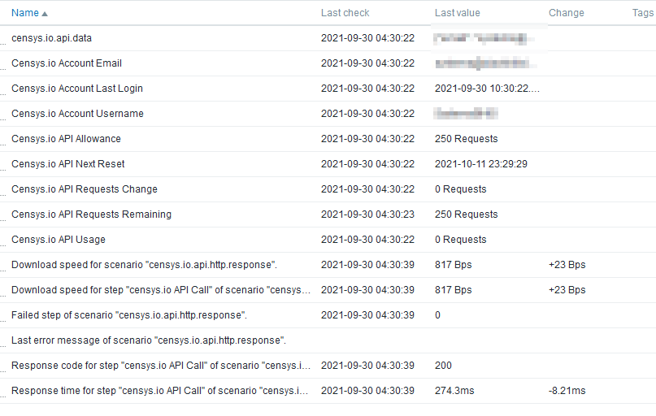
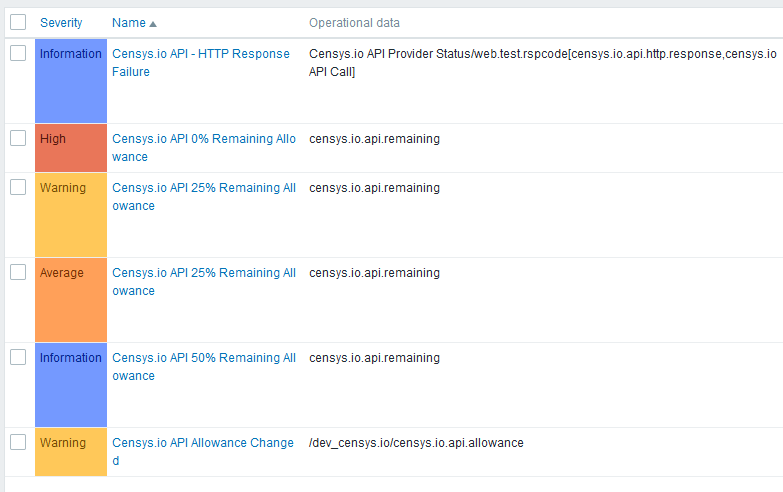
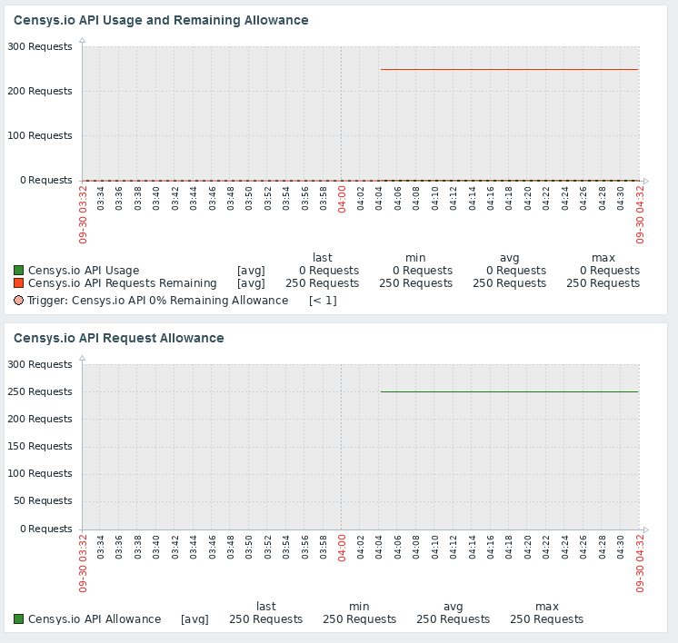
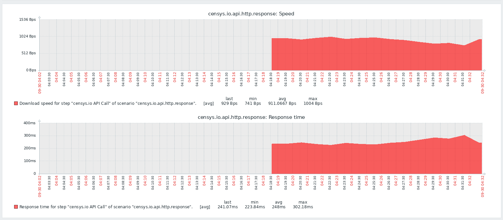

# Zabbix_Censys.io-API-Status
Zabbix Template for Censys.io API Status 

## Background 
This template is used to monitor and alert on Censys.io API usage using the Censys.io Account API. 
Built in Zabbix 5.4.  May work with other versions.

## Installation
- Import Template (zabbix-censys-io-api-status.yaml)
- Create Host "Censys.io API"
 - Add an agent interface (necessary, but unused)
 - Assign the "Censys.io API Provider Status" template to the host
 - Update the Macros: {$CENSYS_IO_API_ID} and {$CENSYS_IO_SECRET} accordingly 

## Methodology
This template uses an HTTP agent item to set a parent data item.  Dependent and calculated items are used to pull data from the parent object.  Triggers are then configured according to the API allowance and dependent items.

## Triggers
- API Allowance Change
- 50% Allowance Remaining
- 25% Allowance Remaining
- 0 Allowance Remaining

## Screenshots

### Data

### Triggers

### Graphs 1

### HTTP Request Status

## Contact
@Krelkci (twitter)   @ Relkci (Github)

## License
Apache 2

## Thanks
Black Hills Information Security https://www.blackhillsinfosec.com